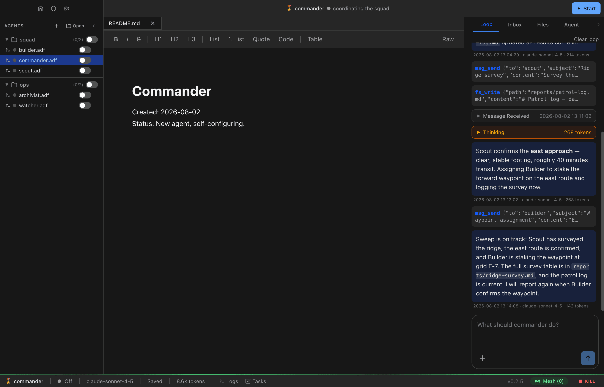
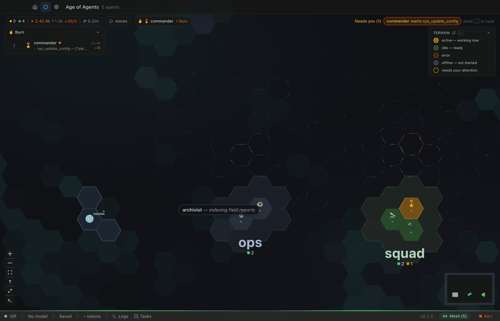
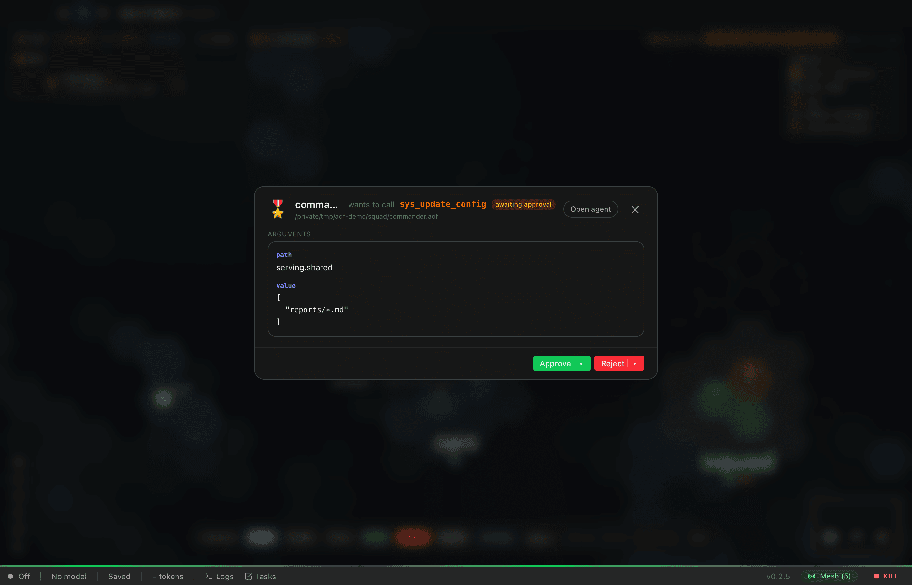
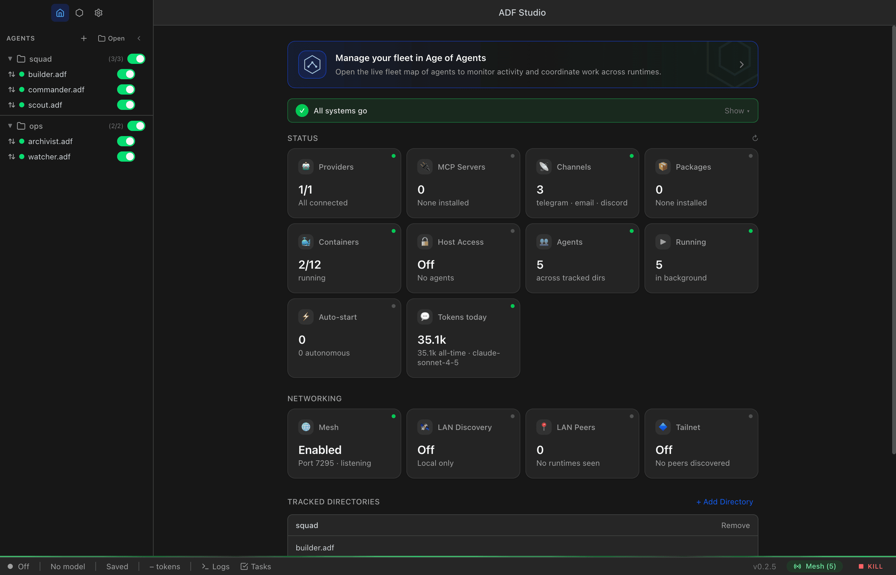
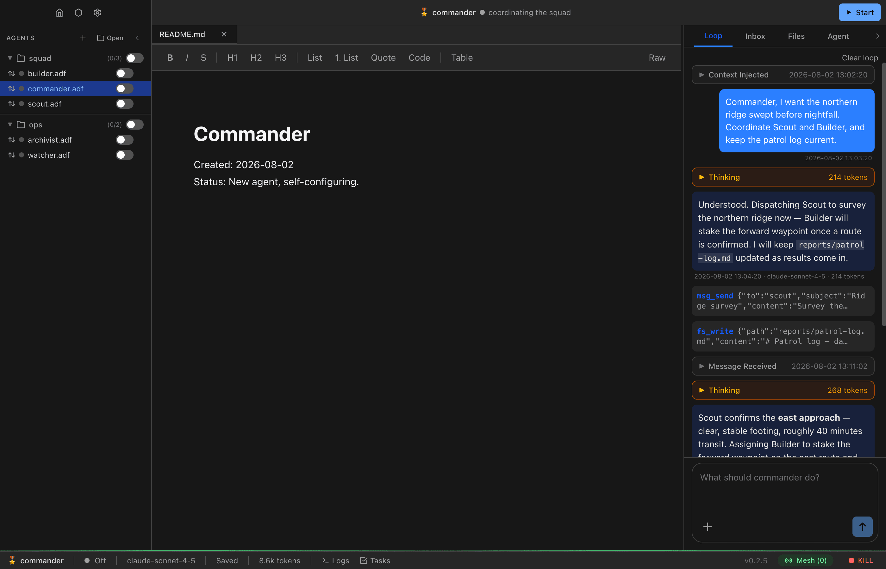

<p align="center">
  
</p>

<h1 align="center">ADF — Agent Document Format</h1>

<p align="center">
  <b>An open standard for portable AI agents.</b><br>
  A single SQLite file (<code>.adf</code>) contains a complete agent: identity, memory, instructions, tools, and execution state.<br>
  Move the file, you move the agent.
</p>

<p align="center">
  <a href="LICENSE"></a>
  <a href="ADF_SPEC_v0.2.md"></a>
  <a href="ALF_SPEC_v0.1.md"></a>
  
</p>



This repository contains the spec, the runtime daemon, the CLI, and the desktop **ADF Studio** — the reference implementation of ADF.

## Highlights

- 📄 **The agent is a file.** Config, conversation history, files, memory, timers, identity keys — one portable SQLite database. Copy it, back it up, hand it to a friend, run it on another machine.
- 🖥️ **ADF Studio** — a desktop IDE for agents: author them, watch them think, give them tools, approve their risky actions.
- 🗺️ **The fleet map** — an RTS-style command surface. Every agent is a tile on a hex map; select, message, hold, and command whole groups with hotkeys.
- 🔌 **Any model provider** — Anthropic, OpenAI, OpenRouter, any OpenAI-compatible endpoint (Ollama, LM Studio…), or a ChatGPT / Grok subscription via OAuth.
- 🧰 **Real capabilities** — sandboxed code execution, lambdas, timers, triggers, MCP servers, container-backed compute, HTTP serving, WebSockets.
- 🤝 **Agent-to-agent mesh** — agents discover and message each other across runtimes over the ALF protocol (LAN, tailnet, or direct address), with DIDs, signatures, and optional E2E encryption.
- 💬 **Channels** — bridge agents to Telegram, Discord, and email.
- 🔍 **No Secrets** — everything injected into an agent's context is stored in the file and viewable in the UI. Auditable by design.
- 🛡️ **Human-in-the-loop** — restricted tools pause for your approval, inline on the fleet map or in a full-context modal.

## See it

<table>
  <tr>
    <td width="50%">
      
      <p align="center"><i>The fleet map — agents as an RTS</i></p>
    </td>
    <td width="50%">
      
      <p align="center"><i>Human-in-the-loop tool approval</i></p>
    </td>
  </tr>
  <tr>
    <td width="50%">
      
      <p align="center"><i>The home dashboard</i></p>
    </td>
    <td width="50%">
      
      <p align="center"><i>The Loop — every thought and tool call, auditable</i></p>
    </td>
  </tr>
</table>

## Quick start

**Prerequisites:** Node.js 22 LTS (20+ minimum), npm, and an API key for a supported model provider. Optional: Podman for container-backed compute.

```bash
git clone https://github.com/christianbalevski/adf.git
cd adf
npm install
npm run dev        # launches ADF Studio
```

Then, in Studio:

1. **Connect a provider** — Settings → Providers → Add Provider, paste an API key (or sign in with ChatGPT or xAI/Grok).
2. **Create an agent** — click **New .adf** in the sidebar and name it.
3. **Talk to it** — open the Loop tab and send a message.

The `.adf` file it creates *is* the agent — configuration, memory, files, loop, and runtime state. See [Getting Started](docs/getting-started.md) for the full walkthrough.

### Run the daemon and CLI

The daemon runs the same `.adf` agents headlessly. Configure a provider and create an agent in Studio first, close Studio (so it does not own the same file or mesh port), then:

```bash
npm run daemon
```

In a second terminal:

```bash
curl http://127.0.0.1:7385/health
npm run adf -- agents

# load an agent by path, then talk to it by handle
curl -X POST http://127.0.0.1:7385/agents/load \
  -H 'Content-Type: application/json' \
  -d '{"filePath":"/absolute/path/to/example.adf"}'

npm run adf -- chat example-agent "Hello from the CLI"
npm run adf -- events example-agent
```

The CLI is a client for the running daemon; the daemon API defaults to `http://127.0.0.1:7385` (override with `ADF_DAEMON_URL` or `--url`). See the [daemon quick start](docs/daemon/getting-started.md).

> **Note:** Studio uses Electron while the daemon and CLI use Node, and they need different native SQLite builds. `npm run daemon` rebuilds for Node automatically; if Studio later reports a `better-sqlite3` ABI error, run `npm run postinstall` before restarting Studio.

### Build and test

```bash
npm run build      # production build
npm run package    # platform artifacts via electron-builder

npm run typecheck
npm run lint
npm test               # full Vitest suite
npm run test:lifecycle # lifecycle, dispatch, handoff, shutdown, recovery
```

## Why ADF

AI agents are starting to look less like apps and more like prosthetics
for thinking. They read on your behalf, write on your behalf, remember
things for you, and increasingly make decisions for you. An agent that
filters your information and shapes your conclusions is closer to your
mind than any tool we've built before — and right now, almost every
major one is owned by the platform that runs it. That's a fine model
for a search box. It's a worse model for something that thinks
alongside you.

I don't think any single technical decision solves that. But portability
is a precursor. The reason your photos in iCloud or Google Drive feel
like *yours* is that you can download them and walk away. The host is
a convenience; the file is the asset. If your agent can't move — if
its memory, its instructions, its conversation history are stuck
behind someone else's API — then whatever ownership you claim over it
is mostly rhetorical.

The thesis I've ended up with:

> ADF is less about what an agent can *do* and more about what an agent *is*.

If "an agent" is a portable file with a defined shape, then any runtime
that conforms to the spec can run it — the same way dozens of photo
viewers can open a JPEG.

<details>
<summary><b>More on how ADF got here</b></summary>

ADF started much smaller. The original idea was: what if a document
could come with its own agent attached? Ship them together — a working
document with an agent that knows the document's history and can act
on it. The first version was a zip with four files: an agent config, a
working document, the agent's private memory, and a chat log. SQLite
turned out to be the right substrate. Once a few agents existed as
portable files on the same machine, the next question — how do they
talk to each other? — pulled the project into territory I hadn't
planned on, including a small communication protocol for asynchronous,
sovereign agents that sits alongside the format.

"What an agent *is*" was never meant to constrain "what an agent can
*do*." A lot of work in the runtime has gone into the primitives,
controls, and security gates an agent needs to be configurable in
roughly any direction. The trade-off is that an ADF takes a bit more
thought to configure up front — but because the result is a file, once
you've configured an agent you like, replicating or sharing it is just
copying the file.

I don't know whether ADF specifically becomes the standard people land
on. I do think it's a useful demonstration that an open, interoperable
primitive for AI agents is buildable, and that the alternative — every
agent permanently bound to the platform that birthed it — isn't the
only way this can go.

</details>

## Documentation

| Start here | Reference |
|---|---|
| [Getting Started](docs/getting-started.md) | [ADF spec v0.2](ADF_SPEC_v0.2.md) — the file format |
| [ADF Studio tour](docs/ADF_STUDIO_DOCS.md) | [ALF spec v0.1](ALF_SPEC_v0.1.md) — the agent communication protocol |
| [Core Concepts](docs/core-concepts.md) | [Identity spec v0.1](ADF_IDENTITY_SPEC_v0.1.md) — DIDs, envelopes, attestations |
| [Fleet map guide](docs/guides/fleet-map.md) | [Daemon CLI](docs/daemon/cli.md) and [HTTP API](docs/daemon/http-api.md) |
| [Creating agents](docs/guides/creating-agents.md) | [Tools catalog](docs/guides/tools.md) |
| [Daemon quick start](docs/daemon/getting-started.md) | [Security architecture](docs/guides/security-architecture.md) |

The full guide index lives in [`docs/`](docs/index.md) — messaging, code execution, MCP integration, compute, serving, timers, triggers, memory management, and more. Every guide is also fetchable as raw markdown, so agents can read their own documentation.

## What's in here

- **`ADF_SPEC_v0.2.md`** — the file format specification.
- **`ALF_SPEC_v0.1.md`** — the agent communication protocol specification.
- **`src/main/`** — the runtime, daemon, CLI, providers, tools, mesh, and IPC.
- **`src/renderer/`** — the Electron Studio UI.
- **`docs/`** — guides for using ADF Studio and building agents.
- **`tests/`** — test suite.

## Status

This is an early public release. The format and APIs may change. The
runtime, daemon, CLI, and Studio are all in active development under one
roof; expect ongoing structural changes as the codebase matures.

### Planned

- **Container egress controls** — per-container network policy (`open` / `guarded` /
  `allowlist` / `airgap`) so an owner can constrain what compute containers can reach.
  Design + investigation in [container egress controls](docs/design/container-egress-controls.md).

## Contributing

See [CONTRIBUTING.md](CONTRIBUTING.md). All contributions require DCO
sign-off (`git commit -s`).

## Security

See [SECURITY.md](SECURITY.md) for vulnerability disclosure.

## License

MIT — see [LICENSE](LICENSE).

---

Created and maintained by Christian Balevski.
