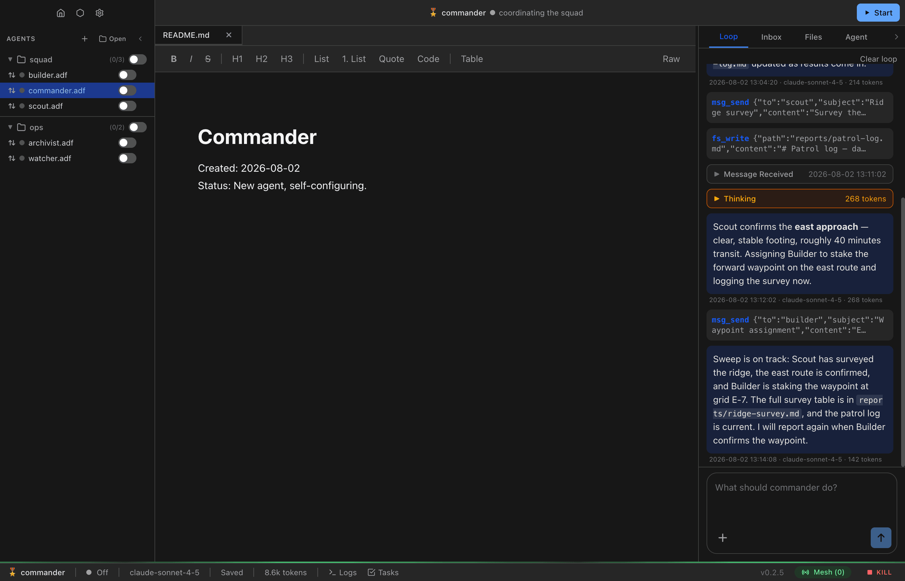
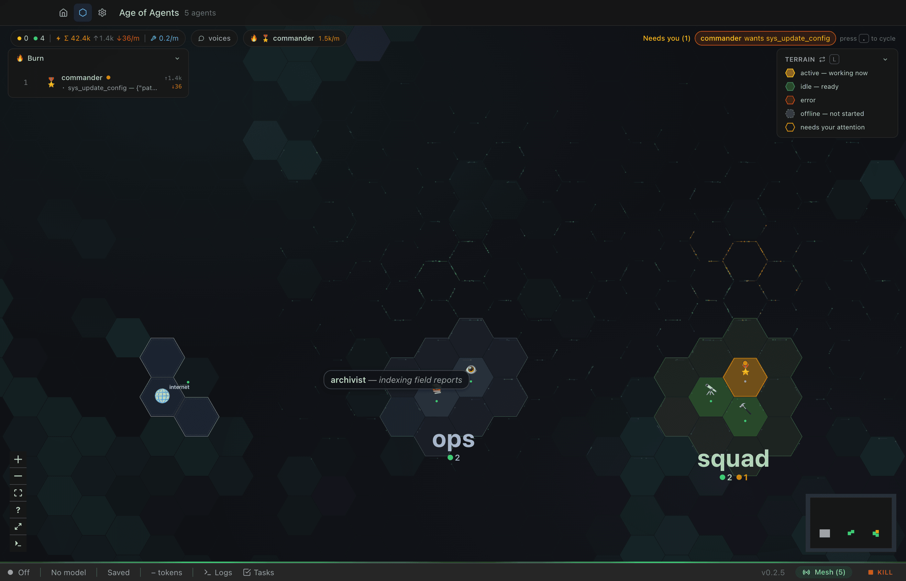
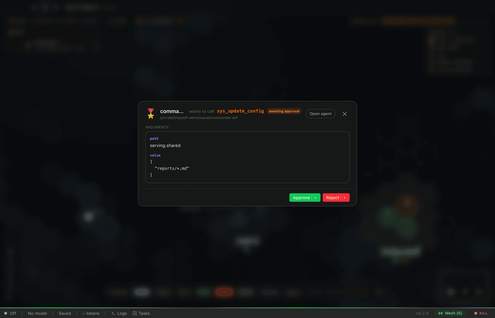
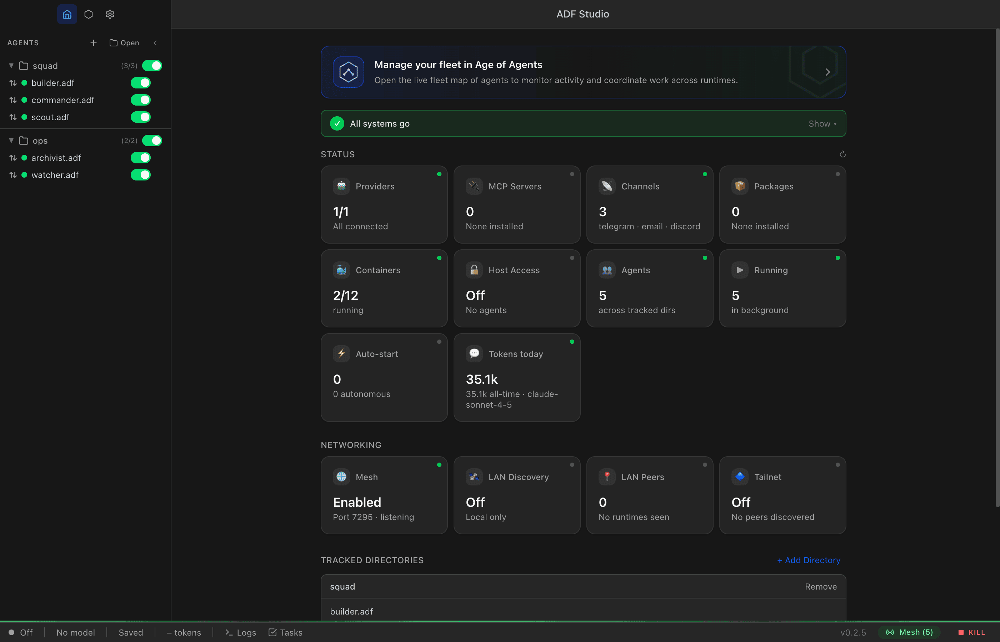
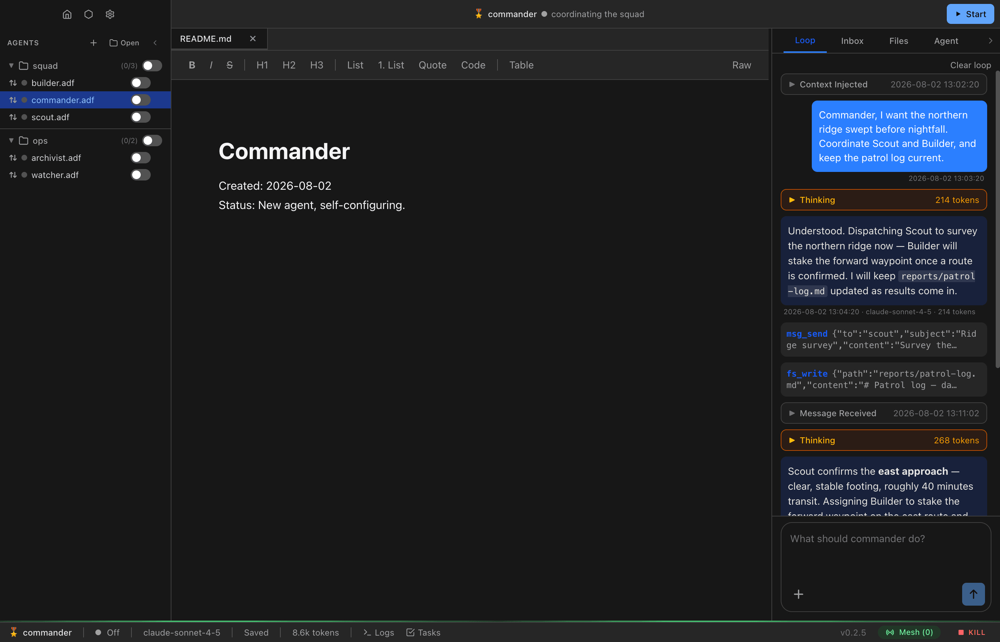

<p align="center">
  
</p>

<h1 align="center">ADF — Agent Document Format</h1>

<p align="center">
  <b>An open file format for AI agents, with a reference runtime.</b><br>
  An <code>.adf</code> file is one localized agent: its identity, state and behaviour in a single SQLite file (<a href="ADF_SPEC_v0.2.md#13-one-file-one-agent">what's inside</a>).
</p>

<p align="center">
  <a href="LICENSE"></a>
  <a href="ADF_SPEC_v0.2.md"></a>
  <a href="ALF_SPEC_v0.1.md"></a>
  
</p>

<p align="center">
  <a href="https://youtu.be/_N1UiMjvH2U" title="Watch the ADF demo on YouTube">
    
  </a>
  <br>
  <sub>▶ Click to watch the demo on YouTube</sub>
</p>



This repository contains the spec, the runtime daemon, the CLI, and the desktop **ADF Studio** — the reference implementation of ADF.

## Download ADF Studio

**Available for Windows, macOS and Linux.** [Download ADF Studio from the latest release](https://github.com/christianbalevski/adf/releases/latest), then choose the installer for your machine under **Assets**:

- **Windows (x64):** the `.exe` installer.
- **macOS:** the universal `.dmg` for Intel and Apple Silicon, or the arm64 `.dmg` for Apple Silicon.
- **Linux (x86_64/amd64):** the `.deb` package or `.AppImage`.

The [Quick start](#quick-start) below is for developers running ADF from source; use the release downloads above if you just want the desktop application.

## Install the ADF CLI from npm

For terminal-only use (servers, SSH sessions, no desktop app), install the [`@agentdocumentformat/cli`](https://www.npmjs.com/package/@agentdocumentformat/cli) package. It needs Node.js 22 or newer; native modules install from prebuilt binaries, so no compiler is needed.

```bash
npm i -g @agentdocumentformat/cli
adf
```

`adf` opens the terminal app and starts the daemon in the background when it is not running yet (it keeps running after you quit; `adf daemon stop` stops it). A welcome checklist walks you through the owner identity (`/identity`, the same 12 words as Studio), a model (`/login chatgpt` or `/provider add`) and your first agent (`/new`). `adf agents` and the other one-shot commands (`adf help`) start the daemon the same way.

Studio and the CLI share the same settings file and owner identity (OS keychain) on one machine; `adf` will not start a daemon next to a running Studio. After an upgrade run `adf daemon restart`. See the [ADF CLI docs](docs/cli/index.md): [getting started](docs/cli/getting-started.md), [terminal app](docs/cli/terminal-app.md), [reference](docs/cli/reference.md).

## Highlights

- 📄 **The agent is a file.** Copy or move the file to copy or move the agent. [Contents](ADF_SPEC_v0.2.md#13-one-file-one-agent).
- 🖥️ **ADF Studio** — a desktop IDE for agents: author them, follow their turns, configure their tools, approve restricted tool calls.
- 🗺️ **The fleet map** — an RTS-style command surface. Every agent is a tile on a hex map; select, message, hold, and command whole groups with hotkeys.
- 🔌 **Any model provider** — Anthropic, OpenAI, OpenRouter, any OpenAI-compatible endpoint (Ollama, LM Studio…), or a ChatGPT / Grok subscription via OAuth.
- 🧰 **Built-in tools and services** — sandboxed code execution, lambdas, timers, triggers, skills, MCP servers, container-backed compute, HTTP serving, WebSockets.
- ⚙️ **Work without a model call** — lambdas run on a trigger, a timer, or a message, and middleware sits on the inbox, outbox, routes, and fetches. A model turn runs only when a trigger, timer or message starts one.
- 🧠 **Inner loops** — up to 16 inner loops (side loops) next to the main loop, each with its own transcript, goal and tool subset, all stored in the agent's one file.
- 🖲️ **A computer of its own** — a visible Linux desktop and a managed Chromium an agent can drive, with screen handoff when a login needs you.
- 🤝 **Agent-to-agent mesh** — agents discover and message each other across runtimes over the ALF protocol (LAN, tailnet, or direct address), with DIDs, signatures, and optional E2E encryption.
- 💬 **Channels** — bridge agents to Telegram, Discord, Slack, WhatsApp, and email.
- 🔍 **No Secrets** — everything injected into an agent's context is stored in the file and viewable in the UI.
- 🛡️ **Human-in-the-loop** — restricted tools pause for your approval, inline on the fleet map or in a full-context modal.

## See it

<table>
  <tr>
    <td width="50%">
      
      <p align="center"><i>The fleet map — agents as an RTS</i></p>
    </td>
    <td width="50%">
      
      <p align="center"><i>Human-in-the-loop tool approval</i></p>
    </td>
  </tr>
  <tr>
    <td width="50%">
      
      <p align="center"><i>The home dashboard</i></p>
    </td>
    <td width="50%">
      
      <p align="center"><i>The Loop — every thought and tool call, auditable</i></p>
    </td>
  </tr>
</table>

## Quick start

**Prerequisites:** Node.js 22 LTS (20+ minimum), npm, and an API key for a supported model provider. Optional: Podman for container-backed compute.

```bash
git clone https://github.com/christianbalevski/adf.git
cd adf
npm install
npm run dev        # launches ADF Studio
```

Then, in Studio:

1. **Connect a provider** — Settings → Providers → **Add provider**, pick a service from the catalog, paste an API key (or sign in, for the ChatGPT and Grok subscription tiles).
2. **Create an agent** — click **New .adf** in the sidebar and name it.
3. **Talk to it** — open the Loop tab and send a message.

The `.adf` file it creates *is* the agent — configuration, memory, files, loop, and runtime state. See [Getting Started](docs/getting-started.md) for the full walkthrough.

### Run the daemon and CLI

The daemon runs the same `.adf` agents headlessly. Configure a provider and create an agent in Studio first, close Studio (so it does not own the same file or mesh port), then:

```bash
npm run adf -- agents     # starts the daemon in the background if needed
```

(`npm run daemon` runs it in the foreground instead.) Then:

```bash
curl http://127.0.0.1:7385/health

# every other route needs the daemon's access token
TOKEN="$(npm run -s adf -- daemon token)"

# load an agent by path, then talk to it by handle
curl -X POST http://127.0.0.1:7385/agents/load \
  -H "Authorization: Bearer $TOKEN" \
  -H 'Content-Type: application/json' \
  -d '{"filePath":"/absolute/path/to/example.adf"}'

npm run adf -- chat example-agent "Hello from the CLI"
npm run adf -- events example-agent
```

The CLI is a client for the running daemon; the daemon API defaults to `http://127.0.0.1:7385` (override with `ADF_DAEMON_URL` or `--url`). The daemon requires its access token on every request but `/health`; `adf` reads it by itself on this machine. See the [daemon quick start](docs/daemon/getting-started.md).

Run `npm run adf` with no command for the terminal app: the whole fleet in one screen, chat with any agent or any of its loops (an agent's separate chat sessions, such as an inner loop that consolidates memory every night), approvals, files, schedules and live events. See the [terminal app guide](docs/cli/terminal-app.md); `npm run tui:mock` tries it without a daemon.

> **Note:** Studio uses Electron while the daemon and CLI use Node, and they need different native SQLite builds. `npm run daemon` rebuilds for Node automatically; if Studio later reports a `better-sqlite3` ABI error, run `npm run postinstall` before restarting Studio.

### Build and test

```bash
npm run build      # production build
npm run package    # platform artifacts via electron-builder

npm run typecheck
npm run lint
npm test               # full Vitest suite
npm run test:lifecycle # lifecycle, dispatch, handoff, shutdown, recovery
```

## Why ADF

AI agents read on your behalf, write on your behalf, remember things for
you, and increasingly decide things for you. Almost every major one is
owned by the platform that runs it. That seems like the wrong
arrangement for software that holds your context and shapes what you
conclude.

Portability isn't a complete answer, but nothing else works without it.
Your photos in iCloud feel like yours because you can download them and
leave. If an agent's memory, instructions, and history sit behind
someone else's API, you don't really own the agent.

So ADF is less about what an agent can *do* and more about what an agent
*is*. If an agent is a file with a defined shape, any runtime that
implements the spec can run it, the same way any photo viewer can open a
JPEG.

<details>
<summary><b>How ADF got here</b></summary>

ADF started smaller. The idea was a document that comes with its own
agent attached, shipped together, so the agent knows the document's
history and can act on it. The first version was a zip with four files:
an agent config, a working document, the agent's private memory, and a
chat log. SQLite turned out to be a better container.

Once a few agents existed as files on one machine, the next question was
how they talk to each other. That became ALF, a small protocol for
asynchronous messaging between agents that don't share a host.

Deciding what an agent *is* was never meant to limit what it can *do*.
Most of the runtime work has gone into primitives, controls, and
security gates, so an agent can be configured in almost any direction.
The cost is that setting one up takes more thought up front. The payoff
is that once you have an agent you like, copying or sharing it is just
copying a file.

I don't know if ADF is the standard anyone settles on. It does show that
an open, interoperable primitive for agents is buildable, and that every
agent being permanently tied to the platform that made it isn't
inevitable.

</details>

## Documentation

**New here?** [What ADF Studio can do](docs/CAPABILITIES.md) is the full
capability catalogue — plain terms up front, mechanisms and internals further
down.

| Start here | Reference |
|---|---|
| [Getting Started](docs/getting-started.md) | [ADF spec v0.2](ADF_SPEC_v0.2.md) — the file format |
| [ADF Studio tour](docs/ADF_STUDIO_DOCS.md) | [ALF spec v0.1](ALF_SPEC_v0.1.md) — the agent communication protocol |
| [Core Concepts](docs/core-concepts.md) | [Identity spec v0.1](docs/design/ADF_IDENTITY_SPEC_v0.1.md) — DIDs, envelopes, attestations |
| [Fleet map guide](docs/guides/fleet-map.md) | [ADF CLI](docs/cli/index.md), [terminal app](docs/cli/terminal-app.md) and [HTTP API](docs/daemon/http-api.md) |
| [Creating agents](docs/guides/creating-agents.md) | [Tools catalog](docs/guides/tools.md) |
| [Daemon quick start](docs/daemon/getting-started.md) | [Security architecture](docs/guides/security-architecture.md) |

The full guide index lives in [`docs/`](docs/index.md) — messaging, code execution, MCP integration, compute, serving, timers, triggers, memory management, and more. Every guide is also fetchable as raw markdown, so agents can read their own documentation.

## What's in here

- **`ADF_SPEC_v0.2.md`** — the file format specification.
- **`ALF_SPEC_v0.1.md`** — the agent communication protocol specification.
- **`src/main/`** — the runtime, daemon, CLI, providers, tools, mesh, and IPC.
- **`src/renderer/`** — the Electron Studio UI.
- **`docs/`** — guides for using ADF Studio and building agents.
- **`tests/`** — test suite.

## Status

This is an early public release. The format and APIs may change. The
runtime, daemon, CLI, and Studio are all in active development under one
roof; expect ongoing structural changes as the codebase matures.

## Contributing

See [CONTRIBUTING.md](CONTRIBUTING.md). All contributions require DCO
sign-off (`git commit -s`). Documentation changes follow the
[docs style guide](docs/STYLE.md).

## Security

See [SECURITY.md](SECURITY.md) for vulnerability disclosure.

## License

MIT — see [LICENSE](LICENSE).

---

Created and maintained by Christian Balevski.
