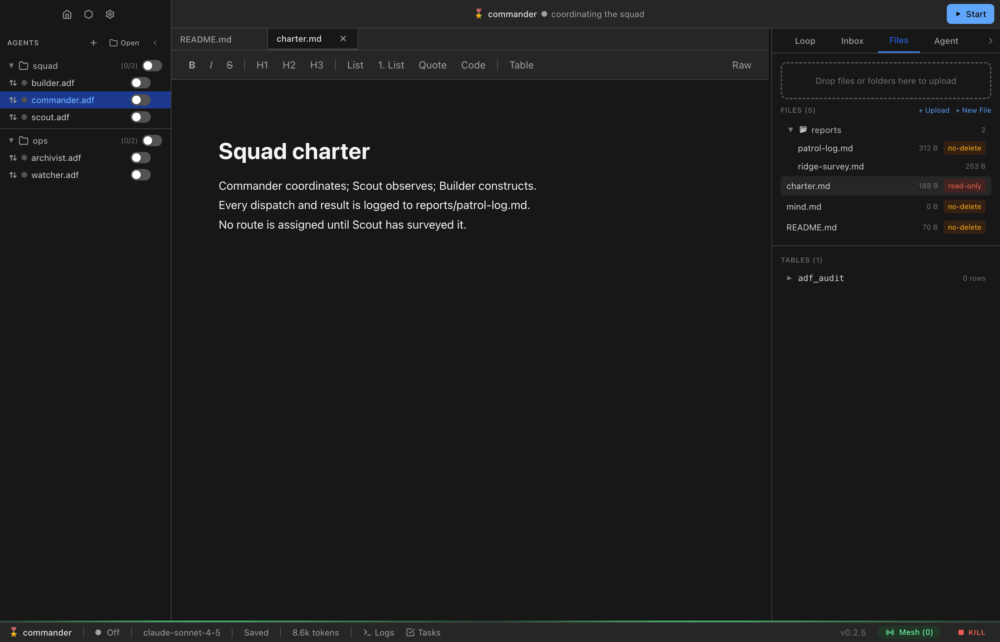

# Documents and Files

Every ADF agent has a virtual filesystem stored inside its `.adf` database. This guide covers the primary document, the mind file, and how to work with the filesystem.

## The Primary Document (README.md)

Each agent has exactly one primary document: `README.md`. It is always a markdown file.

The document is the human-agent interface — a shared surface where the agent presents its work and the human provides input. What it contains depends on the agent's purpose: notes, a dashboard, an essay draft, a report, or anything else that benefits from a persistent, editable artifact.

### Protection

The primary document has `no_delete` protection by default. This means agents cannot delete it but can always write to it — `no_delete` files stay agent-writable; only `read_only` blocks writes. See [File Protection Levels](#file-protection-levels) below for the full three-level system.

### Reaching the Document

`README.md` content is **not** auto-injected into the system prompt. The agent reads it on demand with `fs_read("README.md")` — token-efficient for large documents. If you want the document in the prompt, place a `{{README.md}}` placeholder in the agent's `instructions` (see [Instruction templating](#instruction-templating) below).

## The Mind File (mind.md)

`mind.md` is the agent's working memory. It's always markdown, always protected, and always at the path `mind.md` — seeded at creation with the structured index skeleton (`## Always` / `## Pages` / `## Rules`).

### Purpose

The mind file is where agents store evolving knowledge — learnings, observations, summaries, and notes. While the `instructions` (system prompt) are immutable, the mind file can be freely updated by the agent.

Think of it this way:

- **Instructions** = who the agent is (identity, rules, constraints)
- **Mind** = what the agent knows (knowledge, context, memory)

### Injection Behavior

`mind.md` is injected into the system prompt via a `{{mind.md}}` placeholder in the base prompt (see [Instruction templating](#instruction-templating) below) as a session-start snapshot. Injection is conditional: it happens only when `include_base_prompt` is enabled (or the `{{mind.md}}` token appears in the agent's `instructions`). Mid-session writes via `fs_write` update the file on disk but do not refresh the injected version — the prompt prefix stays stable, so the agent must `fs_read("mind.md")` to see its own mid-session writes. After compaction or loop clear, the runtime re-reads the latest `mind.md` and injects the fresh version.

### Instruction templating

Your `instructions` (and the base system prompt) can pull any workspace file into the system prompt with a `` placeholder — `{{mind.md}}`, `{{README.md}}`, `{{policy/tone.md}}`, etc. The runtime replaces each with that file's contents at session start.

- **Files only** — placeholders resolve against the virtual filesystem (`adf_files`), never identity keys or config. For dynamic or queried values, use a lambda with `loop_inject`.
- **Snapshot** — files are read once per session and refreshed on compaction / loop clear, never mid-session (keeps the prompt cache warm).
- **Single pass** — content pulled in by a placeholder is not itself scanned for more placeholders (no recursion).
- **Provenance tags** — resolved content is wrapped in `<injected_file path="...">…</injected_file>` tags so the agent can tell injected file data from surrounding harness instructions (any literal `</injected_file>` inside the content is escaped). This tagging applies **only** to system-prompt `{{}}` placeholders — not to inbox messages, tool results, or `fs_read` output.
- **Missing files** render a self-closing `<injected_file path="..." missing="true"/>` marker instead of vanishing, so typos stay auditable.
- Templating is independent of the `fs_read` tool — it works even if the agent can't read files itself.

This is how `mind.md` and `soul.md` are injected; it's an ordinary use of the same mechanism, not a special case.

### Compaction

When the agent's conversation history (loop) gets too long, it can summarize important information and write it to `mind.md` via the `loop_compact` tool. This preserves knowledge across conversation resets. See [Memory Management](memory-management.md) for details.

## The Soul File (soul.md)

`soul.md` is the agent's voice and identity file — how it speaks and the worldview behind it. Like `mind.md`, it is a core file created with `no_delete` protection and owned by the agent to rewrite over time.

It is injected into the system prompt via a `{{soul.md}}` placeholder in the base prompt, under the same rules as `mind.md`: a session-start snapshot, conditional on `include_base_prompt` (or the token appearing in `instructions`), refreshed on compaction / loop clear.

Unlike `README.md` and `mind.md`, `soul.md` is **not** exempt from the `limits.max_file_write_bytes` write cap — see [File Write Size Limits](#file-write-size-limits).

## Virtual Filesystem (adf_files)

All files are stored in the `adf_files` table inside the SQLite database. The filesystem is flat but supports path-like names for organization.

### File Protection Levels

Every file in the virtual filesystem has a protection level that controls what operations agents can perform on it:

| Level | Read | Write | Delete | Description |
|-------|------|-------|--------|-------------|
| `read_only` | No | No | No | Fully locked — agents cannot read, write, or delete |
| `no_delete` | Yes | Yes | No | Can be read and written, but not deleted |
| `none` | Yes | Yes | Yes | Fully mutable — no restrictions (default) |

Core files (`README.md`, `mind.md`, and `soul.md`) are locked to `no_delete` protection and cannot be changed to a different level. All other files default to `none`.

In the UI, you can cycle a file's protection level by clicking the protection badge: `none` → `no_delete` → `read_only` → `none`. The badge is color-coded: red for `read_only`, amber for `no_delete`, and gray for `none`.

Tool enforcement:
- `fs_read` — blocked if protection is `read_only`
- `fs_write` — blocked if protection is `read_only`
- `fs_delete` — blocked if protection is `read_only` or `no_delete`

### Reserved Paths

| Path | Protection | Description |
|------|-----------|-------------|
| `README.md` | `no_delete` | The primary document |
| `mind.md` | `no_delete` | Working memory |
| `soul.md` | `no_delete` | Voice and identity |
| `public/*` | `none` | Files readable by other agents without waking the owner |
| `lib/*` | `none` | Support scripts and utilities |

### Recommended Conventions

These paths aren't enforced but are strongly recommended:

| Path | Purpose |
|------|---------|
| `data/` | Agent-managed data files |
| `imports/` | Received attachments (namespaced by sender ID) |
| `lib/` | Support scripts and utilities |
| `public/` | Files visible to other agents |

### Working with Files in the UI

The **Files** tab shows all files in the agent's virtual filesystem, organized in a **collapsible folder tree**. Files are grouped by directory with expand/collapse toggles, folder icons, and file count badges. Each file row shows the filename, size, and protection badge.


From here you can:

- **Browse the folder tree** — Expand and collapse directories to navigate the file structure
- **Open files in the editor** — Click a file to open it in the tabbed code editor (see below)
- **Upload files** — Drag and drop files into the panel. Files with unrecognized extensions (e.g., `.adf`, `.db`, `.dat`) are stored as binary with `application/octet-stream` MIME type
- **Rename/delete/protect** — Use the file preview modal (click a file) to rename, delete, or cycle protection levels
- **View metadata** — The file preview modal shows size, MIME type, protection level, and created/modified timestamps


### Tabbed Code Editor

ADF Studio includes a multi-tab code editor powered by **CodeMirror** for viewing and editing internal ADF files with syntax highlighting. The editor sits alongside the markdown document editor in the main panel.

Key features:

- **Multiple tabs** — Open several files at once; tabs show the filename and a dirty indicator
- **Syntax highlighting** — Automatic language detection based on file extension (TypeScript, JavaScript, Python, JSON, Markdown, etc.)
- **Dirty-state tracking** — Unsaved changes are indicated with a dot on the tab; save with `Cmd/Ctrl + S`
- **Live updates** — When an agent modifies a file (e.g., via `fs_write`), the editor tab updates automatically
- **Binary file handling** — Binary files show a placeholder instead of attempting to render content

When you open an ADF file, `README.md` is automatically opened in the first editor tab. Clicking files in the Files panel opens them in new tabs.



### Working with Files via Tools

Agents interact with the filesystem through the `fs_*` tools:

| Tool | Description |
|------|-------------|
| `fs_read` | Read file content (text files return UTF-8, binary files return base64; supports line ranges) |
| `fs_write` | Write, edit, or append files. `mode` is required (`write` \| `edit` \| `append`); edit does single find-and-replace or an atomic `edits[]` batch, plus `replace_all`. Binary supported. |
| `fs_list` | List files, optionally filtered by path prefix |
| `fs_delete` | Delete a file (respects protection) |

### Large Files

The executor applies two output guards to `fs_read` results when they go to the LLM context:

- **Token limit** — Files exceeding `limits.max_file_read_tokens` (~30k tokens) are truncated with a footer showing the full size
- **Large file preview** — Files over 300 lines (but within the token limit) show only the first 50 lines with a size summary

The agent can use `start_line`/`end_line` to paginate past either guard. From code execution (`sys_code`/`sys_lambda`), `fs_read` always returns full content with no truncation:

```javascript
// In sys_code — always gets the full file
const result = await adf.fs_read({ path: 'data/large_dataset.csv' })
const lines = result.content.split('\n')
// process lines...
```

### File Chunks

Very large files are stored across the `adf_file_chunks` table, split into chunks. This is handled transparently by the runtime — agents and users interact with files through the same API regardless of whether they're chunked.

## Meta Keys (adf_meta)

The `adf_meta` table stores key-value pairs with protection levels. Agents use this for operational state (status, counters, notes) and the runtime uses it for system identity (DIDs, version, timestamps).

### Meta Protection Levels

Every key has a protection level that controls what the agent can do:

| Level | Read | Write | Delete | Use Case |
|-------|------|-------|--------|----------|
| `none` | Yes | Yes | Yes | Agent-managed operational state (default) |
| `readonly` | Yes | No | No | System identity and config (DIDs, version) |
| `increment` | Yes | Increment only | No | Monotonic counters (offspring count, spend tracking) |

Protection is set at creation time and cannot be changed by the agent. The human owner can change any protection level through the UI.

Increment validation: both the stored value and the new value must be valid numbers, and the new value must be strictly greater than the current value.

### Working with Meta Keys via Tools

| Tool | Description |
|------|-------------|
| `sys_get_meta` | Read one key's value, or list all entries as `key\tvalue` lines. Query `adf_meta` directly for protection levels |
| `sys_set_meta` | Create or update a key. Optional `protection` parameter on creation |
| `sys_delete_meta` | Delete a key (blocked if `readonly` or `increment`) |

### Working with Meta Keys in the UI

The **Config** tab includes a **Meta Keys** section at the bottom showing all key-value pairs with color-coded protection badges: red for `readonly`, blue for `increment`, gray for `none`.

From here you can:

- **View/edit a key** — Click a row to open the meta key modal
- **Change the value** — Edit the value in the modal textarea and save
- **Cycle protection** — Click the protection button to cycle: `none` → `readonly` → `increment` → `none`
- **Delete a key** — Click Delete in the modal (the owner can delete any key regardless of protection)
- **Add a new key** — Click "+ Add key" to create a new key with a chosen protection level

### System Keys

Keys prefixed with `adf_` are system-managed and set to `readonly` protection. These include `adf_did`, `adf_name`, `adf_handle`, `adf_schema_version`, `adf_created_at`, `adf_updated_at`, and `adf_parent_did`.

The `status` key is created by default with `none` protection for agents to track their current state.

## Local Database Tables

Beyond the filesystem, agents can create custom SQLite tables for structured data. Tables must not use the `adf_` prefix (which is reserved for system tables).

### Convention

The recommended prefix is `local_` (e.g., `local_chat_history`, `local_embeddings`), but any non-`adf_` name works.

### Creating Tables

Agents create tables via the `db_execute` tool:

```sql
CREATE TABLE local_subscribers (agent_id TEXT, topic TEXT, subscribed_at INTEGER);
```

### Querying Tables

Use `db_query` for SELECT statements and `db_execute` for INSERT/UPDATE/DELETE. The runtime guarantees persistence of these tables.

### Vector Search

The [sqlite-vec](https://github.com/asg017/sqlite-vec) extension is loaded on every ADF database, enabling vector similarity search via `vec0` virtual tables. Use the `local_` prefix as with any agent-created table.

**Creating a vector table:**

```sql
CREATE VIRTUAL TABLE local_embeddings USING vec0(
  document_id TEXT,
  embedding float[384]
);
```

The dimension (e.g. `384`) must match the embedding model you use. Common sizes: 384 (MiniLM), 768 (BERT), 1536 (OpenAI ada-002).

**Inserting vectors:**

```sql
INSERT INTO local_embeddings(document_id, embedding) VALUES (?, ?);
```

Pass the vector as a JSON array (e.g. `[0.1, 0.2, ...]`) via bind parameters.

**Querying nearest neighbors:**

```sql
SELECT document_id, distance FROM local_embeddings
WHERE embedding MATCH ? AND k = 10;
```

The `MATCH` clause performs brute-force nearest-neighbor search using Euclidean (L2) distance. The `k` parameter controls how many results to return. This scales well for up to tens of thousands of vectors per table.

**Important notes:**

- Vectors are stored in binary format internally. Reading the raw `embedding` column returns binary data, not a JSON array — use `MATCH` queries for search, not raw column reads.
- Dimension mismatches on insert produce a clear error (e.g. inserting a 3D vector into a `float[4]` column).
- Updates to both metadata fields and embeddings are supported. Updated vectors participate in search immediately.
- To generate embeddings, use your existing tools — call an embedding API from `sys_code` or a lambda, then insert the resulting vectors via `db_execute`.

### Viewing Tables in the UI

The **Files** tab includes a section for database tables where you can:

- See all custom tables and their row counts
- Query table data with pagination
- Drop tables (custom tables only)
- View the `adf_archive` table (read-only) to see archived data snapshots

## File Write Size Limits

The `limits.max_file_write_bytes` setting (default: 5 MB) controls the maximum size of files an agent can write via `fs_write`. If the content exceeds this limit, the write is rejected with a human-readable error message. An agent hitting the cap can request a raise of `limits.max_file_write_bytes` via [`sys_update_config`](tools.md#sys_update_config) — HIL-gated (your principal approves) — rather than shrinking the work.

This limit does **not** apply to `README.md` or `mind.md`, which have no write size cap. It **does** apply to `soul.md`: despite being a core file, `soul.md` is subject to the cap like any ordinary file.

## The adf-file:// Protocol

ADF Studio registers a custom `adf-file://` protocol for referencing files stored inside the ADF database. It supports both inline images and clickable links to other workspace files.

### Usage

Reference ADF files in markdown using the `adf-file://` scheme:

```markdown
[see notes](adf-file://notes/research.md)

```

- **Links** — Clicking an `adf-file://` link opens the target file in a new editor tab (or activates it if already open). Works in both the markdown editor and the agent loop.
- **Images** — The protocol serves file content directly from the `adf_files` table, so images render inline without extracting to disk.

### Image Support in the Editor

The markdown editor supports:

- **Inline images** — Standard markdown image syntax with `adf-file://` URLs
- **Resizable images** — Drag handles to resize; dimensions are preserved through markdown round-trips as HTML `` tags
- Spaces in file paths are automatically percent-encoded (`%20`)
