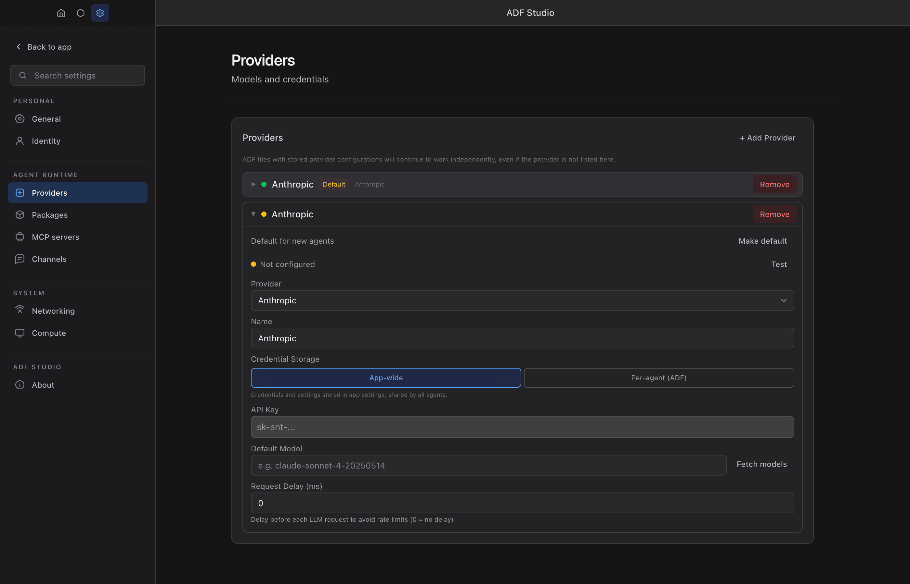

# Getting Started

This guide walks you through your first agent: making one from a message, running it, and sending it somewhere.

## Prerequisites

1. **ADF Studio** installed on your machine
2. Either an LLM API key (Anthropic, OpenAI, OpenRouter, or any OpenAI-compatible endpoint) or a ChatGPT / Grok subscription to sign in with. You are asked for it the first time you run an agent, not before.

## First run

The home screen is a message box. Type what you want an agent to do and press Enter.

1. A new agent file is created in your agents folder (`Documents/adf-agents` by default) under a generated name like `steady-fern`, and opens with its loop in the center.
2. Your message is the agent's first message. It goes through the normal start: if no model provider is connected yet, the **Connect a provider** sheet opens first. Sign in with ChatGPT or Grok, or pick a provider and paste an API key, choose a model, and **Save and start**. The key is saved in app settings, not in the agent's file.
3. The agent answers in the loop. Keep talking to it there; it configures itself from the conversation.

Every message sent from the home screen makes a new agent. To continue with one you already have, open it from the sidebar.

The chips under the message box set up the agent before it exists. The leaf chip is its name; click it for another. The provider chip is the model provider it starts on, listing the ones you have connected, with **Add provider…** to connect another in place. The folder chip is where its file goes. With no provider connected yet, a **Connect a provider** card sits in the middle of the screen and the provider chip reads the same; either opens the provider picker.

Once agents exist, a status line at the top shows how many there are, how many are running, tokens used today, and a link to the fleet map.

The sidebar's `+` creates a blank agent under a name you choose, and its folder button adds a directory of agent files.

## Setting Up a Provider

Providers can also be managed ahead of time, or changed later, in Settings.

1. Open **Settings** (gear icon in the sidebar, or `Cmd/Ctrl + ,`)
2. Go to the **Providers** section
3. Click **Add provider** — a catalog opens, grouped into **Subscriptions**, **APIs**, **Local**, and **Other**
4. Click the tile for the service you use (Anthropic, OpenAI, ChatGPT, Grok, a hosted OpenAI-compatible API, or a local server). The provider is created with its base URL prefilled and its configure modal opens
5. Enter your API key (or click **Sign in with ChatGPT** / **Sign in with Grok** for the subscription tiles)
6. Optionally set a default model
7. Save

## Creating a Blank Agent

1. Click the **New agent** button in the sidebar (the `+`)
2. Choose a name for your agent (e.g., "assistant")
3. A new `.adf` file is created with default settings and the app's default provider

Your agent is now created and in the **idle** state by default.

## Anatomy of the Interface

The ADF Studio interface is organized into several areas:

- **Sidebar** (left) — Lists your open agents, shows their status, and provides quick actions
- **Main Panel** (center) — Shows the active tab content
- **Right Panel** (collapsible) — Additional context and configuration

### Tabs

- **Loop** — The conversation history with your agent. This is where you chat, see tool usage, and observe the agent's reasoning
- **Inbox** — Messages received from other agents
- **Files** — The agent's virtual filesystem (document, mind, and uploaded files)
- **Agent** — Configuration panel with sub-tabs for Timers, Identity, and raw Config

## Talking to Your Agent

1. Select your agent from the sidebar
2. Make sure you're on the **Loop** tab
3. Type a message in the input field at the bottom
4. Press Enter to send

When you send a message, several things happen:

1. The agent transitions from **idle** to **active**
2. The agent's LLM processes your message along with its instructions, document, and available tools
3. The agent responds (and may use tools along the way)
4. The agent returns to **idle**

You'll see the full conversation in the Loop panel, including any tool calls the agent makes.

## Configuring Your Agent

Click the **Agent** tab to access configuration. Key settings include:

- **Name and Description** — How your agent identifies itself
- **Icon** — An emoji shown in the sidebar
- **Instructions** — The system prompt that defines your agent's behavior
- **Model** — Which LLM provider and model to use
- **Tools** — Which built-in tools the agent can access
- **Triggers** — What events wake the agent

See [Creating and Configuring Agents](creating-agents.md) for full details.

## Sharing an Agent

An agent is one file, so sending it is moving the file. Drag an agent row out of the sidebar onto your desktop, into a message, or onto another computer running ADF Studio. Right-click the row and choose **Share…** for a dialog with the same drag chips and a **Save copy…** button.

The copy the app hands over is a consistent snapshot, taken even while the agent runs, with the identity stripped.

- **In the file:** config and agent instructions; README, memory and files; loop history; lambdas, skills and tool settings; provider names and base URLs (no keys).
- **Not in the file:** identity keys (the receiver claims a new identity); provider keys and sign-ins, which stay in app settings; credentials sealed to you — unless you set a share password, in which case they travel sealed and open only with it.

Whoever opens the file gets the same review dialog you did.

## What's Next?

- Learn about [Core Concepts](core-concepts.md) to understand the ADF philosophy
- Explore [Agent States](agent-states.md) to understand idle, hibernate, and autonomous mode
- Set up [Triggers](triggers.md) to make your agent respond to events automatically
- Enable [Messaging](messaging.md) to let multiple agents collaborate
