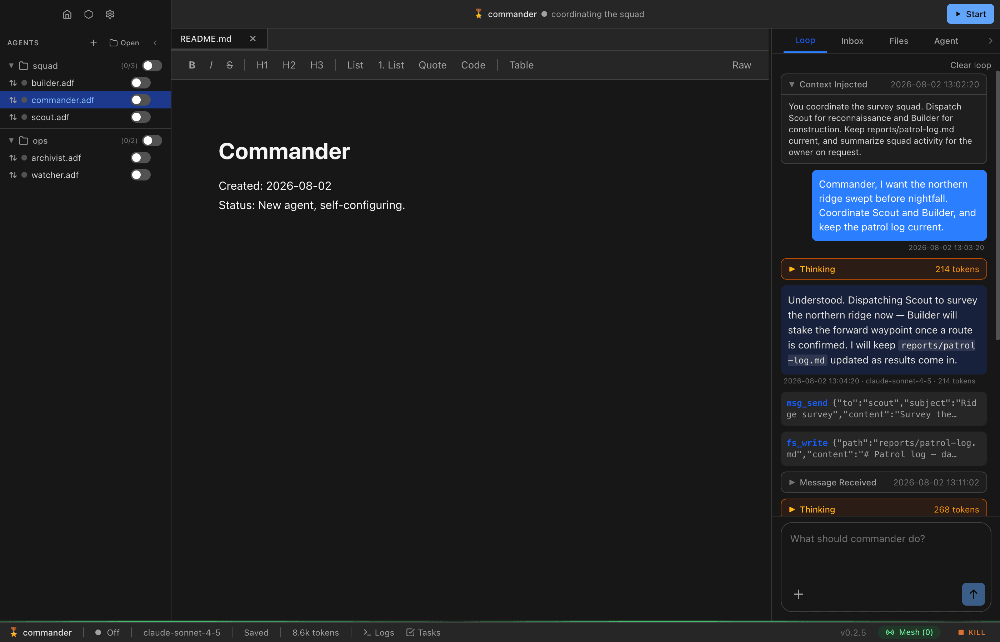

# Memory Management

ADF agents have two forms of memory: the **loop** (conversation history) and the **mind** (persistent working memory). Managing these effectively is key to long-running agents.

## The Loop (adf_loop)

The loop is the agent's conversation history — every message, tool call, and response is stored as a row in the `adf_loop` table. This is what gets sent to the LLM as context.

### Loop Structure

Each entry has:

- **seq** — Auto-incrementing sequence number
- **role** — `user` or `assistant`
- **content_json** — JSON array of content blocks (text, tool use, tool results)

### Viewing the Loop

The **Loop** tab in the UI shows the full conversation history, including:

- User messages (your chat input)
- Assistant responses
- Tool calls (with expandable input/output)
- Tool errors
- Inter-agent messages
- State transitions
- Plan/reasoning steps
- Approval requests
- Context blocks (injected system prompt and dynamic instructions)


### Loop Growth

Every interaction adds to the loop. Over time, this grows and eventually hits limits:

- More tokens sent per turn = higher cost
- Eventually exceeds the model's context window
- Older context becomes less relevant

This is where compaction comes in.

## Context Blocks (No Secrets)

Every LLM API call includes content that the user doesn't directly author — the system prompt and per-turn dynamic instructions. ADF follows a "No Secrets" principle: any content injected into the agent's context must be viewable and auditable.

Context blocks are stored as regular entries in `adf_loop` and appear in the Loop tab as collapsible teal blocks. They persist across sessions, survive restarts, and are swept by compaction like any other loop entry.



### What Gets Recorded

| Category | When Written | Contents |
|----------|-------------|----------|
| **System Prompt** | First turn, and whenever the prompt changes (instructions edited, document/mind content changed in included mode, mesh status changed) | The full system prompt sent to the LLM — base prompt, tool guidance, agent instructions, document/mind content (when included), identity, mesh status, messaging guidance |
| **Dynamic Instructions** | Each turn where non-null and changed from previous | Per-turn context injected as a trailing user message — inbox status notifications, context limit warnings |

### Deduplication

Context blocks are only written when their content changes:

- **System prompt** uses the existing hash cache (doc + mind + mesh + config hashes). A new entry is written only when the composite hash differs from the previous turn.
- **Dynamic instructions** are compared as strings. A new entry is written only when the content differs from the previous turn.

This avoids spamming the loop in multi-tool-call turns where both functions are called repeatedly.

### Querying Context Blocks

Context entries are regular `adf_loop` rows with a `[Context: <category>]` prefix:

```sql
-- All context entries
SELECT * FROM adf_loop WHERE content_json LIKE '%[Context:%' ORDER BY seq DESC

-- System prompt history
SELECT * FROM adf_loop WHERE content_json LIKE '%[Context: system_prompt]%' ORDER BY seq DESC
```

## Compaction

Compaction is the process of summarizing old conversation history and preserving the important parts so the agent can continue working with full context.

### LLM-Powered Compaction

Compaction uses a dedicated LLM call to generate a high-quality summary. The `loop_compact` tool is **signal-only** — the agent calls it (optionally with an `instructions` string to steer the summary) and the runtime handles the rest:

1. Agent calls `loop_compact()` (no summary parameter needed; an optional `instructions` string can guide the summarizer)
2. Runtime reads the full conversation transcript
3. A dedicated LLM call generates a structured briefing covering: current task state, key decisions, files/agents/resources involved, pending work, and constraints
4. Old loop entries are deleted (audited if audit is enabled)
5. The LLM-generated summary is inserted as a `[Loop Compacted]` user message
6. A compaction banner appears in the UI
7. Token counter resets

The compaction LLM is prompted to produce a concise briefing (under 1500 words) with specific details — file paths, function names, error messages — organized by topic in bullet points.

### Automatic Compaction

When the loop reaches `context.compact_threshold` (default: 100,000), the runtime injects a system message instructing the agent to call `loop_compact`. The agent triggers compaction, and the LLM-powered summarization handles the rest.

### Manual Compaction

Agents can proactively call `loop_compact()` at any time to manage their own memory. This is useful for:

- Preserving important learnings before they scroll out of context
- Keeping the loop focused on the current task
- Reducing token costs

### The loop_compact Tool

```
loop_compact()
```

This is a signal-only tool — it takes only an optional `instructions` string (guidance for the summarizer), never the summary itself. When called:

1. The runtime makes a dedicated LLM call to summarize the conversation
2. Old loop entries are deleted (audited if enabled)
3. The summary is inserted as the new conversation starting point

### Compact Threshold

The `context.compact_threshold` setting (default: 100,000) defines the token count that triggers automatic compaction.

## Audit

When you clear loop entries, delete messages, delete files, or compact the loop, the data doesn't have to be lost forever. ADF supports an **audit system** that compresses and stores snapshots of cleared data before deletion.

The audit table is written for the **operator**: the agent manages its own context (compact, clear, delete) without that bookkeeping depending on whether history is being retained. It is not hidden from the agent, though — `adf_audit` is a readable table for `db_query` (SELECT only; it is append-only, so writes are rejected), and an agent reflecting on its own past is expected to read it. See the `self-observation` skill for how to decompress rows.

### How Audit Works

**Loop audit (on clear/compaction):**

1. Before deletion, the cleared loop entries are serialized to JSON
2. The JSON is compressed using **brotli compression** for efficient storage
3. The compressed snapshot is stored in the `adf_audit` table with metadata: `source`, the seq range of the archived entries (`start_seq`/`end_seq`), `entry_count`, `size_bytes`, `created_at`
4. The original rows are then deleted — their seqs stay addressable via the blob's seq range

**Per-message audit (on ingestion/send):**

When audit is enabled for inbox or outbox, the runtime also captures individual messages at ingestion/send time:

1. The full ALF message — including inline base64 attachment data — is captured before the data is stripped and files are extracted to the filesystem
2. The JSON is brotli-compressed and stored in `adf_audit` with source `inbox_message` or `outbox_message` and `ref` set to the message id
3. This provides a forensic record of exactly what was sent/received, even if extracted attachment files are later modified or deleted by the agent

Per-message capture is the message archive: deleting inbox/outbox messages later does not write additional audit rows (batch `inbox`/`outbox` audit rows exist only in files created by older versions).

**File audit (on deletion):**

When file audit is enabled, `fs_delete` snapshots the file's content (as base64), path (also stored in the row's `ref` column), mime type, and size before the hard delete. This is especially important for binary/multimodal content (images, audio, etc.) that only exists in `adf_files` — the loop only records the tool call metadata, not the actual bytes.

### Configuring Audit

Audit is configured per data source in the agent config:

```json
{
  "audit": {
    "loop": true,
    "inbox": true,
    "outbox": true,
    "files": true
  }
}
```

Each source (loop, inbox, outbox, files) can be independently toggled. **`loop` defaults to `true`; `inbox`, `outbox`, and `files` default to `false`.** Loop audit is on by default because compaction is the one routine operation that discards history irreversibly, and the compressed snapshots are cheap next to losing the transcript. When `inbox` or `outbox` is enabled, each message is captured at ingestion/send time. When `files` is enabled, file content is snapshot before deletion via `fs_delete`. You can also configure audit from the **Agent** configuration panel in the UI, and an agent can toggle these paths itself — e.g. `sys_update_config({ "path": "audit.inbox", "value": true })` (see [sys_update_config](tools.md#sys_update_config)). These writes are HIL-gated (your principal approves) — and disabling `audit.loop` in particular is exactly the kind of self-interested change an owner will scrutinize.

### Audit Sources

| Source | Trigger | Key Columns | What's Stored |
|--------|---------|-------------|---------------|
| `loop` | Loop clear / compact | `start_seq`, `end_seq` (seq range) | Serialized loop entries |
| `inbox_message` | Message received | `ref` = message id | Full ALF message with inline attachment data |
| `outbox_message` | Message sent | `ref` = message id | Full ALF message with inline attachment data |
| `file` | File deleted via `fs_delete` | `ref` = path | File path, content (base64), mime type, size |
| `inbox` / `outbox` | *(legacy only — no longer written)* | — | Batch of deleted messages |

Rows written by older versions may have NULL `start_seq`/`end_seq`/`ref`.

### Which Operations Trigger Audit

- `loop_compact` — Audits old loop entries before removing them
- `loop_clear` — Audits entries before deletion
- `fs_delete` — Audits file content before deletion (if files audit enabled)
- **Message receive** — Audits the full inbound ALF message (per-message, if inbox audit enabled)
- **Message send** — Audits the full outbound ALF message (per-message, if outbox audit enabled)

Message deletion (`msg_delete`) writes no audit rows — the per-message capture at arrival/send is the archive. If audit is disabled for a source, data is permanently deleted on clear/compact/delete, and no per-message or per-file audit entries are created. Messages that arrived while audit was disabled (or before per-message capture existed) have no audit row — enabling audit later does not retroactively archive them.

## The Mind File (mind.md)

`mind.md` is the agent's persistent working memory. Unlike the loop (which gets compacted), the mind file persists indefinitely.

### What Goes in Mind

`mind.md` is not a flat notes file — it is the always-loaded **index** over a wiki of memory pages:

- **`## Always`** — a few lines that must load every turn (principal, standing constraints, current focus)
- **`## Pages`** — a catalog of one-line links to pages in `mind/<slug>.md`
- **`## Rules`** — the maintenance rules the agent follows

Durable knowledge lives in the pages (`mind/<slug>.md`, with typed YAML frontmatter, loaded on demand); `mind/log.md` is the append-only history of mind changes. See [Agent Memory](agent-memory.md) for the full pattern — page contract, citations, and the retrieval recipe.

### Mind vs. Instructions

| Aspect | Instructions | Mind |
|--------|-------------|------|
| Purpose | Identity and rules | Knowledge and memory |
| Mutability | Immutable (by agent) | Freely writable |
| Content | Who the agent is | What the agent knows |
| Growth | Static | Grows over time |

### Injection Behavior

`mind.md` is injected into the system prompt as a session-start snapshot, conditional on `include_base_prompt` being enabled (or a `{{mind.md}}` placeholder appearing in the agent's `instructions`). Mid-session writes update the file on disk but do not refresh the injected version. After compaction or loop clear, the runtime re-reads the latest `mind.md` and injects the fresh content. The agent must call `fs_read("mind.md")` to see its own mid-session writes.

## Loop Management Tools

### loop_compact

```
loop_compact()
loop_compact(instructions: "Preserve the deploy checklist verbatim.")
```

Trigger LLM-powered compaction. The runtime generates a summary, clears old entries, and inserts the summary. Accepts an optional `instructions` string to steer what the summary preserves. See [Compaction](#compaction) above.

### loop_clear

```
loop_clear()                    # Clear all entries
loop_clear(end: 5)              # Clear first 5 entries
loop_clear(end: -5)             # Clear all except last 5
loop_clear(start: -10)          # Clear last 10 entries
loop_clear(start: 2, end: 8)   # Clear entries 2 through 7
```

Delete loop entries using Python-style slicing. If audit is enabled, entries are compressed and stored in `adf_audit` before deletion. See [Tools > loop_clear](tools.md#loop_clear) for full details.

### loop_inject (code execution only)

```javascript
await adf.loop_inject({
  content: 'inbox_summary: 3 unread messages from monitor',
  category: 'inbox_summary',
  key: 'inbox_summary'
})
```

Inject **user context** into the active loop from code execution (`sys_code`/`sys_lambda`). Not a regular tool — controlled via the **Code Execution** config section (`code_execution.loop_inject`). ADF writes an auditable versioned `[Context: …]` loop entry immediately, then queues it for the next model boundary. This preserves valid tool-call ordering: context is never inserted between an assistant `tool_use` and its user `tool_result`.

Use `category` to make provenance legible; ADF records the runtime-derived origin so code cannot forge it. Use a stable `key` for mutable state such as a skills registry; if several keyed updates arrive before the next model call, only the latest is sent, while every version stays in `adf_loop` for audit. A key does not remove a value that has already been delivered in provider history. On restart, only the latest keyed entry is re-queued; unkeyed one-shot notices are not replayed. Only text with the user role is accepted—system, assistant, tool-call, and tool-result injection are intentionally unavailable.

## Strategies for Long-Running Agents

### Regular Compaction

For agents that run frequently, set a reasonable `context.compact_threshold` and let automatic compaction handle it. The runtime summarizes, clears the old context, and inserts the summary back into the loop (it is not written to mind).

### Structured Mind

The default mind is already structured: `mind.md` is a small index (`## Always` facts, a `## Pages` catalog, `## Rules`), pages live in `mind/<slug>.md` with typed frontmatter, and `mind/log.md` records changes:

```markdown
# Mind

## Always
- Principal: christian; current focus: Q1 report

## Pages
- [Monitor agent](adf-file://mind/monitor-agent.md) — slow on weekends, prefers batch queries

## Rules
1. Keep this index small — details go in pages.
...
```

See [Agent Memory](agent-memory.md) for the full pattern.

### Database for Structured Data

For data that's better stored in tables than in markdown, use `db_execute` to create local tables:

```sql
CREATE TABLE local_observations (
    timestamp INTEGER,
    category TEXT,
    observation TEXT
);
```

This keeps the mind file for narrative memory and uses tables for structured data.

## Clearing Agent State

In the UI, you can clear agent state from the Agent configuration panel:

- **Clear loop** — Delete all conversation history
- **Clear mind** — Reset mind.md to empty
- **Clear inbox** — Delete all received messages
- **Clear all** — Reset everything except config and files

This is useful for resetting an agent without recreating the file.
