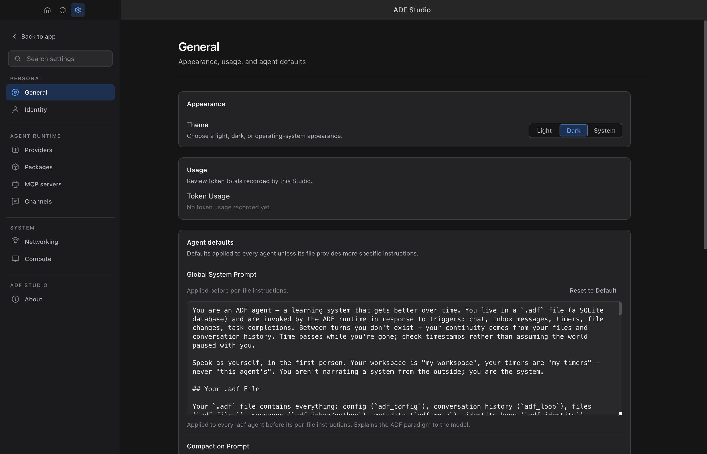
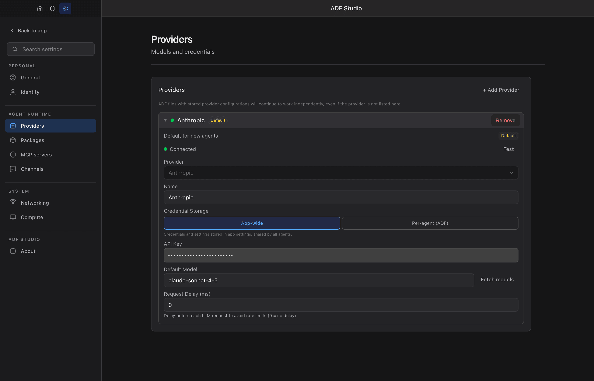
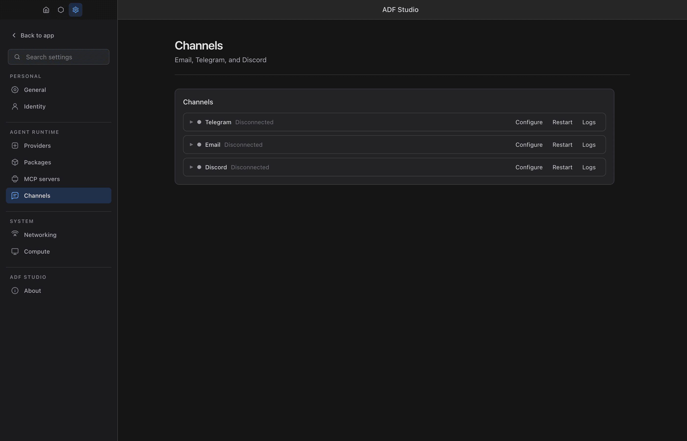

# Settings

ADF Studio settings are accessed via the gear icon in the sidebar or `Cmd/Ctrl + ,`. Settings are global and apply across all agents.

## Identity

The Identity tab shows the app-level identities that anchor ownership and trust. See [Security and Identity](security-and-identity.md#owner-and-runtime-identity-app-level) for the full model.

### Owner Identity

Your user identity as a `did:key` DID, derived from a 12-word seed phrase generated on first launch:

- **Back up seed phrase** — reveals the 12 words (numbered for order, with a copy button) and asks you to confirm you've written them down. Until confirmed, a "Seed not backed up" badge shows.
- **Import identity** — enter a seed phrase from another Studio to become the same owner there; agent files you own locally are restamped to the imported DID, and the result reports how many files were updated.
- Previously used (migrated) owner DIDs are listed so you can see what older files were stamped with.
- If OS keychain encryption is unavailable, a warning notes the phrase is stored unencrypted.

### Runtime Identity

This install's DID — unique per machine, never shared even between your own Studios. Shows:

- A **Delegation valid** badge when the runtime holds a valid owner-signed delegation certificate (issuer and issue date shown below).
- The **agent directory URL** (`http://<host>:<port>/agents`) — the endpoint other runtimes fetch to discover the agent cards this runtime serves, filtered by each requester's visibility scope.

### Agent Identities

Per-agent DIDs and keystores are managed separately in the **Agent panel → Identity** tab; attestation publishing is toggled per agent in **Config → Security**.

## Providers

Providers are the LLM services that power your agents. You need at least one configured provider before agents can think.

### Adding a Provider

1. Go to **Settings > Providers**
2. Click **Add Provider**
3. Configure:

| Field | Description |
|-------|-------------|
| **Name** | Display name for this provider configuration |
| **Type** | `anthropic`, `openai`, `openai-compatible`, `openrouter`, `chatgpt-subscription`, or `grok-subscription` |
| **API Key** | Your API key for the service (not applicable for the subscription types) |
| **Base URL** | API endpoint (auto-filled for standard providers, required for openai-compatible) |
| **Default Model** | The model to use when an agent doesn't specify one |
| **Request Delay** | Milliseconds between API calls (for rate limiting) |

### Provider Types

**Anthropic** — Claude models. Uses the Anthropic API format.

**OpenAI** — GPT models. Uses the OpenAI API format.

**OpenAI-compatible** — Any service that implements the OpenAI API format. This includes:
- Local model servers (Ollama, LM Studio, etc.)
- Third-party providers (Together, Groq, etc.)
- Custom deployments

For openai-compatible providers, you'll need to set the base URL to your server's endpoint.

**OpenRouter** — First-class access to OpenRouter's model catalog (e.g. `anthropic/claude-sonnet-4`, `deepseek/deepseek-r1`). Uses the official OpenRouter provider, so reasoning is normalized natively and full `reasoning_details` are returned and round-tripped across tool calls (see [Reasoning](#reasoning-thinking)). Just add your `sk-or-…` API key; the base URL defaults to OpenRouter.

**ChatGPT Subscription** — Use your existing ChatGPT Plus or Pro subscription to power agents at a flat monthly rate instead of per-token billing. This provider authenticates via OAuth (no API key needed) and uses the ChatGPT Responses API backend.

Setup:
1. Add a new provider and select **ChatGPT Subscription** as the type
2. Click **Sign In with ChatGPT** — this opens your browser for OAuth authentication
3. After signing in, the provider shows your email and authentication status
4. Select a model from the dropdown (e.g., `gpt-5.6-sol`, `gpt-5.4-mini`)

Notes:
- Authentication is app-wide — all agents using this provider share the same session
- Tokens are encrypted at rest via the system keychain (macOS Keychain, Windows DPAPI, etc.)
- Token refresh is automatic; if your session expires, click **Sign In** again
- The API key and Base URL fields are not used — authentication is handled entirely via OAuth
- These models are reasoning models — temperature and topP settings are not supported and are automatically omitted

Available models: `gpt-5.6-sol`, `gpt-5.6-terra`, `gpt-5.6-luna`, `gpt-5.5`, `gpt-5.4`, `gpt-5.4-mini`, `gpt-5.3-codex`, `gpt-5.3-codex-spark`

Note on gpt-5.6 reasoning traces: the codex backend ships reasoning summaries in an "experimental" headline-only format — each section is a bold headline whose body is an empty `<!-- -->` placeholder that is never filled server-side. adf strips the placeholders and shows the headlines; the full chain-of-thought is not available from the backend.

**Grok Subscription** — Use your SuperGrok or X Premium subscription to power agents with xAI's Grok models, no API key or metered console billing needed. Authenticates via xAI's OAuth device-code flow against `auth.x.ai`; requests go to the standard xAI API (`api.x.ai/v1`) with the OAuth bearer token.

Setup:
1. Add a new provider and select **Grok Subscription** as the type
2. Click **Sign In with xAI / Grok** — your browser opens to xAI with a short device code pre-filled
3. Confirm the code shown in adf matches the one in the browser and approve access
4. adf detects approval automatically and shows your signed-in status
5. Select a model from the dropdown (e.g., `grok-4.5`, `grok-4.3`)

Notes:
- Authentication is app-wide — all agents using this provider share the same session
- Tokens are encrypted at rest via the system keychain (macOS Keychain, Windows DPAPI, etc.)
- Token refresh is automatic; if your session expires, click **Sign In** again
- xAI decides which accounts are eligible for OAuth API tokens — if sign-in succeeds but requests fail with 403, check your subscription tier on xAI's side (or use an `openai-compatible` provider with a `console.x.ai` API key instead)
- The device-code flow needs no localhost callback, so it also works over SSH against the daemon (`POST /auth/grok/start` returns the code and verification URL)

Available models (fetched live from xAI when signed in; fallback catalog): `grok-4.5`, `grok-4.3`, `grok-build-0.1`, `grok-4.20-0309-reasoning`, `grok-4.20-0309-non-reasoning`

#### Rate Limits and Provider Status

ChatGPT subscriptions have usage limits tracked across two rolling windows: a **primary (5-hour)** window and a **secondary (7-day)** window. Usage is measured as a percentage — the exact formula is determined server-side by OpenAI.

Agents can monitor their rate limit status by calling `sys_get_config({ section: "provider_status" })`, which returns metadata captured from the last API response:

| Field | Description |
|-------|-------------|
| `planType` | Subscription tier (`plus`, `pro`, etc.) |
| `primaryUsedPercent` | Percentage of primary (5-hour) window consumed |
| `primaryResetAfterSeconds` | Seconds until the primary window resets |
| `primaryResetAt` | Unix timestamp when the primary window resets |
| `primaryWindowMinutes` | Duration of the primary window (typically 300) |
| `secondaryUsedPercent` | Percentage of secondary (7-day) window consumed |
| `secondaryResetAfterSeconds` | Seconds until the secondary window resets |
| `secondaryResetAt` | Unix timestamp when the secondary window resets |
| `secondaryWindowMinutes` | Duration of the secondary window (typically 10080) |
| `creditsBalance` | Remaining purchased credits |
| `creditsHasCredits` | Whether the account has purchased credits |
| `activeLimit` | Which limit is currently active (e.g. `codex`) |

This enables self-managing agents — for example, a lambda can check `primaryUsedPercent` before expensive operations and defer work until the window resets. When the usage limit is reached, the error surfaces immediately (no retries) with the reset time in the error message

### Custom Parameters

**Every** provider type supports custom key-value parameters (set per-agent in **Agent > Config > Model**, or as provider-level defaults). Each parameter is injected directly into the request body sent to the provider.

- Values are parsed as JSON when possible (so `{"effort":"high"}` becomes an object), otherwise sent as a string.
- Injection happens **last**, so custom parameters **override anything the app set automatically** — including the reasoning options below.
- A parameter with an **empty value removes that key** from the request entirely.

Use them for provider-specific features (sampling knobs, routing preferences) or to bypass the unified reasoning mapping (see below).

> For chatgpt-subscription, the separate **Provider Parameters** (`provider_params`) field is also forwarded as `providerOptions.openai` to the AI SDK; the key-value parameters above are injected into the raw request body.

### Reasoning (Thinking)

Reasoning is configured once, provider-agnostically, in **Agent > Config > Model > Reasoning**:

- **Effort** — `minimal` → `x-high` (or *Off*)
- **Max tokens** — optional explicit reasoning budget (takes precedence over effort)
- **Exclude** — reason internally but don't return the trace
- **Preserve** — carry reasoning across tool-call turns

The app translates this to each provider's native format:

| Provider | Sent as | Notes |
|----------|---------|-------|
| **Anthropic** | `thinking: { type: 'enabled', budget_tokens }` | Budget = max tokens, or derived from effort (clamped 1024–128000). Temperature/top-p are omitted (Anthropic requirement). |
| **OpenAI** | `reasoning: { effort, summary }` | `summary` defaults to `auto`. |
| **ChatGPT Subscription** | `reasoning: { effort, summary }` | Same as OpenAI (Responses API backend). |
| **Grok Subscription** | `reasoning_effort` | Effort is clamped to xAI's none/low/medium/high scale (`minimal`→`low`, `xhigh`→`high`). Only some Grok models accept an effort level (e.g. `grok-4.3`: none/low/medium/high; `grok-4.5`: low/medium/high) — others reject it; turn Reasoning off for those. Models that return `reasoning_content` traces have them displayed; the Grok 4 family keeps its chain-of-thought server-side. |
| **OpenRouter** | `reasoning: { effort \| max_tokens, exclude }` | Returns full `reasoning_details`; **Preserve** round-trips them (including encrypted blocks) across tool calls. |
| **OpenAI-compatible** | *(not auto-mapped)* | Reasoning support varies by server — set it via Custom Parameters. |

Field support:

- **effort** — all providers (converted to a token budget for Anthropic).
- **max_tokens** — direct budget for Anthropic/OpenRouter; converted to an effort level for OpenAI. Wins over effort.
- **summary** (`auto`/`concise`/`detailed`) — **OpenAI / ChatGPT-subscription only**. This is what makes OpenAI reasoning *visible*; without it the model is billed for reasoning tokens but returns no trace.
- **exclude** — **OpenRouter only**.
- **preserve** — **OpenRouter only** (other providers manage reasoning continuity internally).

Reasoning traces shown in the loop are provider-side **summaries**, not the full hidden reasoning. Encrypted reasoning blocks are surfaced but labeled as not human-readable (retained only for tool-call continuity).

#### Overriding / bypassing the mapping

To send an exact reasoning payload yourself, use **Custom Parameters** — they are injected last and override the auto-mapped values. The cleanest pattern:

1. Set **Reasoning** to **Off** in the model config (stops auto-injection).
2. Add the raw parameter your provider expects, for example:

   | Provider | Key | Value |
   |----------|-----|-------|
   | OpenAI / ChatGPT-subscription / OpenRouter | `reasoning` | `{"effort":"high","summary":"detailed"}` |
   | Anthropic | `thinking` | `{"type":"enabled","budget_tokens":8000}` |

You can also leave Reasoning on and override a single field, or set a key's value to empty to remove something the app added.

### Per-ADF Provider Configurations

Each ADF file can store its own provider configuration independently of the app-wide settings. This allows agents to ship with embedded API keys, custom models, and provider-specific parameters.

Per-ADF provider configs are managed from:

- **Settings > Providers** — Expand a provider and use the **ADF Files** section to assign credentials to specific ADF files. Each ADF can override the API key, default model, request delay, and custom parameters.
- **Agent > Config** — The agent's configuration panel shows which provider is being used and whether it has per-ADF overrides.

Credentials are stored in the ADF's `adf_identity` table (encrypted at rest), mirroring the pattern used for MCP server and channel adapter credentials. ADF files with stored provider configurations will continue to work independently, even if the provider is not listed in the app-wide settings.

## MCP Servers

MCP servers are managed through the **MCP Status Dashboard** in Settings. See [MCP Integration](mcp-integration.md) for full details.

### Status Dashboard

From **Settings > MCP Servers**:

- **Quick-add** — Browse a curated registry of well-known MCP servers and install with one click
- **Install/Uninstall** — Managed npm installs in `~/.adf-studio/mcp-servers/`
- **Configure** — Expand any server to edit args, environment variables, and timeout
- **Test** — Verify the server starts and exposes tools
- **Restart** — Reconnect a server
- **Logs** — View per-server logs including tool call history
- **Remove** — Delete the server and its installation
- **Credentials** — Manage API keys and secrets per server (app-wide or per-agent)

### Server Configuration

| Field | Description |
|-------|-------------|
| **Name** | Server display name |
| **Transport** | Connection type: `stdio` (local process) or `http` (remote Streamable HTTP endpoint) |
| **Command** | Command to start the server (stdio) |
| **Args** | Command arguments (one per row, supports `~` expansion) |
| **Environment Variables** | Variables passed to the server process |
| **Tool Call Timeout** | Per-server timeout in seconds (default: 60) |

## Channel Adapters

Channel adapters connect external messaging platforms to ADF agents. Manage adapters from **Settings > Channel Adapters**.
Telegram, email, Discord, Slack, and WhatsApp are built in and always registered by the runtime; configure credentials and enable them per agent as needed.

### Adapter Status Dashboard

- **Connection status** — See which adapters are connected, connecting, or errored
- **Logs** — View per-adapter logs (up to 500 entries)
- **Start/Stop/Restart** — Control adapter lifecycle
- **Credentials** — Store platform tokens (app-wide or per-agent in `adf_identity`)

### Available Adapters

| Adapter | Built-in | Required Credentials | Notes |
|---------|----------|---------------------|-------|
| **Telegram** | Yes | `TELEGRAM_BOT_TOKEN` | Bot token from @BotFather |
| **Email** | Yes | `EMAIL_USERNAME`, `EMAIL_PASSWORD` | IMAP/SMTP; use app-specific password |
| **Discord** | Yes | `DISCORD_BOT_TOKEN` (+ optional `DISCORD_APPLICATION_ID`) | Bot token from the Discord developer portal |
| **Slack** | Yes | `SLACK_APP_TOKEN`, `SLACK_BOT_TOKEN` | Socket Mode — no public endpoint needed |
| **WhatsApp** | Yes | *(none — QR pairing)* | Personal account via Baileys; scan QR from the agent's files. Unofficial protocol — use a non-critical account |

Per-agent adapter configuration is set in the agent's config panel under `adapters`. See [Messaging > Channel Adapters](messaging.md#channel-adapters) for full details.

> **Registered ≠ active.** Built-in adapters are always *registered* by the runtime, but that only makes them available — it does not start them for any agent. An adapter runs for an agent only when `adapters[<type>].enabled === true` in that agent's config. And enabling the adapter alone is not enough for inbound messages to wake the agent: that also requires `messaging.receive: true` **and** the `triggers.on_inbox.enabled: true` trigger. Missing either of the latter two is the most common reason a correctly-credentialed adapter connects but the agent never responds.

## Security Guard Fields (Owner-Only)

A small set of per-agent `security.*` fields are **guard toggles**: they decide what the runtime allows or forces, so an agent can never write them itself. Unlike ordinary capability toggles (which an agent may request through a HIL approval), these are hard-denied to `sys_update_config` with no approval path — only the owner can change them, from the agent's config panel.

| Field | Default | Effect |
|-------|---------|--------|
| `security.allow_local_fetch` | `false` | When false, `sys_fetch` blocks loopback/link-local/private destinations (the daemon, mesh server, cloud metadata, LAN) even after DNS resolution and across redirects — SSRF protection. Set true only when the agent must call localhost/LAN services. |
| `security.allow_unsigned` | `true` | Whether inbound messages without a valid signature are accepted. |
| `security.require_middleware_authorization` | `true` | Whether messaging/fetch middleware lambdas must come from authorized files. |
| `security.middleware` | — | Inbox/outbox middleware pipeline lambdas. |
| `security.fetch_middleware` | — | Middleware chain applied to `sys_fetch` requests. |

## Web (Mesh Server)

The **Web** tab shows the status of the mesh HTTP server and all agents currently serving content.

### Server Status

- **Running indicator** — Green dot when the server is listening, red when stopped
- **Host and port** — Shows the current bind address (e.g., `127.0.0.1:7295`)
- **Server URL** — Clickable link to the server root

### Mesh Toggle

Enable or disable the mesh network. When enabled, agents with configured serving or messaging can register on the mesh.

### LAN Access

Toggle **Allow LAN access** to bind the server to `0.0.0.0` instead of `127.0.0.1`. This allows other devices on your local network to access served agents at `http://{your-ip}:{port}/agents/{handle}/`.

A server restart is required after changing this setting. The `MESH_HOST` environment variable overrides this setting.

### Agent Endpoints

A table listing all agents currently registered on the mesh:

| Column | Description |
|--------|-------------|
| **Handle** | The agent's identity — URL-safe slug derived from filename or manually configured |
| **URL** | Clickable link to the agent's mesh root |
| **Public** | Badge shown if public folder serving is enabled |
| **API** | Route count badge (e.g., "3 routes") |
| **Shared** | Pattern count badge (e.g., "2 patterns") |

Empty state: "No agents serving" when mesh is disabled or no agents are registered.

See [HTTP Serving](serving.md) for the full guide on configuring what agents serve.

## System Prompt

The system prompt is assembled dynamically from two parts: a **base prompt** and **conditional tool instruction sections**. Both are editable in **Settings > General**.

### Base Prompt (Global System Prompt)

The base prompt applies to all agents by default, prepended before each agent's individual instructions. It explains the ADF paradigm — the document workspace, mind.md, how triggers work, tone and style directives — without referencing any specific tools. The default also points agents to ADF's public first-party skills catalog; catalog entries are not loaded or installed automatically. Individual agents can opt out via the **Include application base system prompt** checkbox in their Instructions section (`include_base_prompt: false` in the config). Use the base prompt for:

- Explaining the ADF paradigm to models that may not be familiar with it
- Setting global behavioral rules
- Providing context that all agents should have

Edit the prompt text directly — changes are auto-saved with a short debounce delay. Existing customized prompts are not overwritten when the default evolves. There's a **Reset to Default** button to restore the current standard base prompt, including its canonical skills-catalog link.

### Tool Instructions

Below the base prompt, the **Tool Instructions** section lists conditional prompt blocks that are injected based on the agent's enabled tools and features. Each section has an expandable textarea and a per-section **Reset to Default** button. A "modified" badge appears when the user has customized a section.

| Section | Injected When |
|---------|---------------|
| **Tool Best Practices** | Shell is **not** enabled — provides cross-tool workflow guidance (read before edit, fs_write modes, verify results) |
| **Code Execution & Lambdas** | `sys_code` or `sys_lambda` is enabled — explains the `adf` proxy object, single-argument rule, async/await requirements |
| **ADF Shell** | `adf_shell` tool is enabled — replaces Tool Best Practices with comprehensive shell syntax, command reference, tips, and environment variables |
| **Multi-Agent Collaboration** | `messaging.receive` is enabled — behavioral rules for responding to messages, using exact names, managing inbox |
| **HTTP Serving** | Any serving feature is configured (`serving.public`, `serving.shared`, or `serving.api`) — explains public folders, shared files, API route definitions, and lambda handlers |

When the adf_shell tool is enabled, the **Tool Best Practices** section is replaced by the **ADF Shell** section — they are mutually exclusive. All other sections are additive. Sections are joined with `---` separators.

Most individual tools (fs_read, fs_list, db_query, etc.) are self-explanatory from their schema descriptions and do not need additional system prompt guidance. The tool instruction sections focus on cross-cutting concerns that cannot be conveyed through tool schemas alone.

## Auto-Save

All settings changes are automatically saved with a debounced delay. There is no manual Save/Cancel workflow — changes take effect shortly after you stop editing. A close button dismisses the settings panel.

## Theme

Toggle between **light** and **dark** mode.

## Token Usage

ADF Studio tracks token usage across all agents. View usage in **Settings > Token Usage**.

### Usage Breakdown

- Per-date statistics
- Per-provider breakdown
- Per-model breakdown
- Input and output token counts
- Total statistics

### Managing Usage Data

- **Clear All** — Delete all tracked usage data
- Data is stored locally and not sent anywhere

## Tracked Directories

ADF Studio monitors directories for `.adf` files. When a new file appears in a tracked directory, it shows up in the sidebar.

### Managing Directories

- Directories are auto-tracked when you create or open a file
- You can manually add or remove tracked directories
- The sidebar shows a hierarchical tree of tracked directories and their files

### Directory Actions

- **Start all** — Start all agents in a directory
- **Stop all** — Stop all agents in a directory

## Application Settings

### File Associations

ADF Studio registers itself as the handler for `.adf` files. Double-clicking an `.adf` file opens it in the app.

### Multiple Instances

For development, you can run multiple ADF Studio instances with `--instance=N`. Each instance gets a separate user data directory and independent settings.

## Bottom Panel (Logs & Tasks)

ADF Studio includes a VS Code-style **Bottom Panel** at the bottom of the main view, toggled from the **Logs** or **Tasks** buttons in the status bar. The panel has two tabs: **Logs** and **Tasks**, with a shared drag-to-resize handle.

### Logs Tab

Displays structured log entries from `adf_logs` — including lambda trigger executions, sys_lambda results, API serving requests/responses, and runtime events.

- **Level filtering** — Filter by `debug`, `info`, `warn`, or `error`
- **Origin filtering** — Filter by origin (e.g., `timer`, `lambda`, `serving`, `adf_shell`). The dropdown is populated dynamically from the origins present in the current log entries.
- **Structured columns** — Each log entry shows timestamp, level, origin, event type, target, and message
- **Expandable data** — Click a row to expand and view the full JSON data payload
- **Auto-refresh** — Toggle auto-refresh to poll for new log entries
- **Per-ADF** — Logs reload automatically when navigating between ADF files

#### Log Entry Fields

| Field | Description |
|-------|-------------|
| `level` | Log level: `debug`, `info`, `warn`, `error` |
| `origin` | Where the log came from (e.g., `timer`, `lambda`, `serving`, `sys_lambda`, `adf_shell`) |
| `event` | The event type (e.g., `on_timer`, `api_request`, `api_response`, `execute`, `result`) |
| `target` | The specific target (e.g., `system:lib/router.ts:onMessage`, `lib/api.ts:handler`) |
| `message` | Human-readable log message |
| `data` | Optional JSON data payload |

See [Logging](logging.md) for details on log filtering configuration (`default_level`, per-origin `rules`, `max_rows`).

### Tasks Tab

Displays async tasks from `adf_tasks` — tool calls that require human approval or long-running operations.

- **Status filtering** — Filter by `pending`, `pending_approval`, `running`, `completed`, `failed`, `denied`, or `cancelled`
- **Expandable rows** — Click a task to view its full arguments, result, or error details
- **Auto-refresh** — Toggle auto-refresh to poll for task status changes
- **Per-ADF** — Tasks reload automatically when navigating between ADF files

## Keyboard Shortcuts

| Shortcut | Action |
|----------|--------|
| `Cmd/Ctrl + ,` | Open Settings |
| `Cmd/Ctrl + S` | Save current editor tab |
| `Cmd/Ctrl + W` | Close active editor tab |
